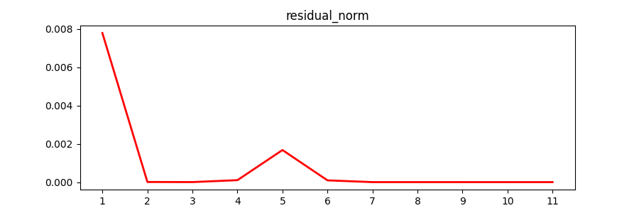

# Checklist geral - Apagar após dar check em todos / terminar o EP


- [ ] Informações requisitadas pelo professor para os exercícios 1 e 2 (analisar se o 3 precisa).
    - [ ] Apresentar a solução estimada em cada iteração
    - [ ] Medir tempo computacional de procedimentos
        - [ ] Escrever como a medida foi feita e porque ela é confiável.
        - [x] Criar gráficos.

- [ ] Comentar código.

- [x] Escrever fundamentação teórica
    - [x] Newton (e Jacobiana)
    - [x] Broyden
    - [x] Diferenças finitas
- [ ] Colocar as referências (RemaniFinal.pdf e outras referências do Wikipedia).

- [ ] Ter certeza de que cada resultado tem, no relatório, uma base teórica e um comentário se o resultado satisfez ou não as expectativas teóricas.
- [ ] Criar sumário (table of contents)
- [ ] Ter certeza de que as animações funcionam no PDF
- [ ] Explicitar as especificações do computador onde os tempos foram testados

# Fundamentação teórica

## Método de Newton

O método de Newton é um método iterativo para encontrar raízes de uma equação matemática. O método de Newton é mais simplesmente descrito para resolver equações
de uma variável, mas é mais frequentemente utilizado em sistemas de equações.

### Uma variável
Para usar o método de Newton, você precisa escolher uma estimativa inicial para a raiz da equação (chamada de $p_0$) e, em seguida, usar essa estimativa para 
calcular uma nova estimativa mais precisa (chamada de $p_1$). Esse processo é repetido até que a raiz seja encontrada com uma precisão suficiente. A formula de 
iteração é a seguinte:

$$ p_{n}= p_{n-1} -\frac{f(p_{n-1})}{f'(p_{n-1})} $$

O método de Newton é conhecido por ser rápido e preciso, mas é necessário ter cuidado ao escolher a estimativa inicial, pois ela pode afetar a precisão do 
resultado final. Além disso, o método de Newton **pode falhar se a derivada da função em algum ponto da iteração não existir** ou **se a estimativa inicial 
estiver muito longe da raiz verdadeira**.
Essa última ressalva é verdadeira devido a seguinte fórmula:

$$f(p) = f(p_0) + (p-p_0) * f'(p_0) + \frac{(p-p_0)^2}{2} * f''(\varepsilon(p)) $$

Note que, se $p_0$ (ponto inicial) for próximo o suficiente de $p$, o termo quadrático pode ser removido e fórmula de iteração é deduzida manipulando os termos 
restantes (lembrando que $f(p) = 0$). Entretanto, caso a estimativa inicial seja distante da raiz $p$ de tal forma que o termo quadrático não se torne 
desprezível, muito dificilmente o método converjirá para alguma solução (salvo situações, onde, por exemplo, a função contém múltiplas raízes e o ponto 
inicial se aproxima de uma raiz não esperada). 

Animações com demonstração do método para uma variável:

1. Função com o desenho da tangente em cada ponto da iteração  
   
 
2. Método de Newton com o cálculo do erro em relação ao valor verdadeiro da raiz  
   

Note que, na animação acima, a partir de certo ponto $x = x_0$, o erro decresce muito em poucas iterações. 

O algoritmo em Python pode ser encontrado no <a href=https://github.com/Gustavino/map2220-ep>repositório do projeto</a>.

### Múltiplas variáveis

O método de Newton para sistemas de equações não lineares é semelhante ao método de Newton para equações de uma variável. A principal diferença é que, em vez de
trabalhar com uma única equação, o processo é feito utilizando um sistema de equações.

O processo é o seguinte:

1. Escolha uma estimativa inicial para as raízes do sistema (chamadas de $p_0$).
2. Use a estimativa inicial para calcular uma nova estimativa mais precisa (chamada de $p_1$). Para fazer isso, você precisa resolver o sistema de equações 
   usando a estimativa inicial como valores para as variáveis.
3.  Repita o processo até que a raiz seja encontrada com uma precisão suficiente.

Como no caso de equações de uma variável, é importante escolher uma estimativa inicial razoavelmente próxima das raízes verdadeiras para garantir que o método 
de Newton funcione corretamente. Além disso, é possível que o método de Newton **falhe se as derivadas parciais da equação não existirem** ou **se a estimativa 
inicial estiver muito longe das raízes verdadeiras**.

O processo iterativo para o caso de sistemas não lineares é o seguinte:

* Define-se uma função $G$:
  $$G(x) = x - J(x)^{-1}F(x)$$
 Onde $x = x_0$ é a estimativa inicial, $J$ é a matriz jacobiana de $F$ e $F$ é a função a qual deseja-se encontrar a raiz. A seguir, é definida a 
  fórmula de iteração:
 
$$x^{(k)} = G(x^{(k-1)}) = x^{(k-1)} - J(x^{(k-1)})^{-1}F(x^{(k-1)})$$
 Este é o algoritmo iterativo utilizado para as aplicações-problema do projeto e seu código fonte em Python está localizado nesse <a href=https://github.com/Gustavino/map2220-ep>projeto</a>.

* **Qual a importância do jacobiano para esse método?**
  
  O Jacobiano é uma matriz de derivadas parciais que é usada no método de Newton para aproximar o comportamento da função em uma região próxima de uma dada 
  estimativa. Ele é uma ferramenta importante para o método de Newton, pois ajuda a encontrar a direção de maior declive da função, o que é essencial para 
  encontrar rapidamente as raízes do sistema.
  
  Sem o Jacobiano, seria necessário calcular as derivadas parciais da função individualmente, o que poderia ser bastante trabalhoso. 
  
  Em resumo, o Jacobiano é um componente importante do método de Newton para sistemas de equações não lineares, pois permite aproximar o comportamento da função
  de forma rápida e precisa, o que facilita a busca pelas raízes do sistema.
  

* **Como é caracterizado o vetor de resíduos?**  
  
  No algoritmo do método de Newton para sistemas de equações não lineares, o vetor de resíduos $R$ é dado por $R(x) = r^{(n)} = F(x^{(n)}) -F(x^{(n-1)})$, para 
  $n>0$ onde $F$ é o sistema de equações não lineares e $x$ é o vetor de variáveis.
  
  Durante a execução do algoritmo, o objetivo é minimizar o valor do vetor de resíduos até que ele se torne suficientemente pequeno, o que significa que as 
  raízes do sistema foram encontradas com precisão suficiente. Portanto, o comportamento esperado para o vetor de resíduos ao longo da execução do algoritmo é 
  que ele diminua progressivamente até atingir um valor suficientemente pequeno.


* **Como é calculada a convergência?**  
  A convergência do método de Newton pode ser definida como a diferença entre dois resíduos subsequentes ($|r^{(n)} - r^{(n-1)}| < TOL$, onde $TOL$ é a 
  tolerância de precisão) ou, como implementado no algoritmo utilizado nos resultados desse relatório, alguma norma aplicada sobre o vetor $y$ solução do 
  sistema de equações $J(x)y = -F(x)$.  
  O vetor $y$ pode ser interpretado como o passo e, uma vez que sua norma é pequena o suficiente, 
  pode-se dizer que o algoritmo convergiu. 
  
## Método de Broyden

O método de Broyden é um método iterativo para encontrar raízes de equações não lineares. Ele é semelhante ao método de Newton, 
mas em vez de calcular a inversa da matriz Jacobiana em cada iteração, o método de Broyden usa uma aproximação da matriz Jacobiana. Devido a essa aproximação, 
o método de Broyden é categorizado como um método quasi-Newton.  
O método é particularmente útil para casos onde é difícil calcular a matriz Jacobiana exata ou onde ela é muito cara de calcular.  
O método de Broyden é uma generalização para maiores dimensões do **método das secantes**.
* **Desempenho vs Newton**:  
  Em notação Big O, o número de cálculos necessários para o método de Newton é $O(n^3)$, onde $n$ é o número de incógnitas. 
  Isso se deve ao fato de que é necessário calcular a inversa da matriz Jacobiana, que é uma operação de complexidade $O(n^3)$ para matrizes $n{\times}n$.  
  
  Em contrapartida, o número de cálculos necessários para o método de Broyden é $O(n^2)$.  
  Isso acontece porque, em vez de calcular a inversa da matriz Jacobiana, o método de Broyden usa uma aproximação da matriz Jacobiana e atualiza essa 
  aproximação a cada iteração. Essas operações são de complexidade $O(n^2)$.
  
O algoritmo implementando o método de Broyden está localizado no <a href=https://github.com/Gustavino/map2220-ep>repositório do projeto</a>.

## Diferenças finitas
Diferenças finitas é uma técnica numérica utilizada para aproximar derivadas de uma função em um ponto específico. Ela consiste em utilizar a diferença entre o
valor da função em um ponto e o valor da função em um ponto próximo, dividida pela diferença entre os pontos, para obter uma aproximação da derivada.  

A aproximação obtida é chamada de diferença finita, e a precisão da aproximação depende da diferença entre os pontos. Para uma boa precisão, 
é necessário tornar o passo $h$ muito pequeno
Diferenças finitas são comumente utilizadas para calcular derivadas de funções que não podem ser derivadas analiticamente, ou para obter derivadas aproximadas 
de funções que são difíceis de serem derivadas analiticamente.

As diferenças finitas utilizadas no projeto, a pedido do enunciado, foram as seguintes: 

* Forward differences:
$$f'(x_0) = \frac{f(x_0 + h) - f(x_0)}{h} - \frac{h}{2} f''(\varepsilon)$$
  
* Centered differences:
$$f'(x_0) = \frac{1}{2h}[f(x_0 + h) - f(x_0 - h)] - \frac{h^2}{6} f^{(3)}(\varepsilon_1)$$

As diferenças centrais têm como termo dominante do erro $O(n^2)$, portanto, é esperado que seja mais precisa devido ao seu menor erro de truncamento.  

# Resolução dos exercícios e resultados

## Item 1

> a. Partindo de $\vec{x}_0=(10,10,10,10,10)$, encontrar a solução para o sistema de equação não-lineares usando o método de Newton. Analisar os resultados 
> (solução estimada, resíduo, convergência e tempo computacional necessário para convergência).  

* **Tabela com a solução estimada por iteração até a convergência**:
```python
A função convergiu com sucesso em 11 iterações.
A solução para esse sistema de equações, utilizando o método de Newton, é: [3.43023016e-03, 3.13264968e+01, 6.83504014e-02, 8.59528996e-01, 3.69624414e-02].
Portanto, a solução encontrada é igual à solução conhecida e exposta pelo enunciado.
╒═════════════╤═════════════╤══════════╤════════════╤═══════════╤════════════╕
│   iteration │         x_1 │      x_2 │        x_3 │       x_4 │        x_5 │
╞═════════════╪═════════════╪══════════╪════════════╪═══════════╪════════════╡
│           0 │ 10          │ 10       │ 10         │ 10        │ 10         │
├─────────────┼─────────────┼──────────┼────────────┼───────────┼────────────┤
│           1 │  0.010652   │  9.99922 │  5.00103   │  5.03642  │  0.0364587 │
├─────────────┼─────────────┼──────────┼────────────┼───────────┼────────────┤
│           2 │  0.0100115  │ 10.0101  │  2.49921   │  2.59112  │  0.0367451 │
├─────────────┼─────────────┼──────────┼────────────┼───────────┼────────────┤
│           3 │  0.00998373 │ 10.0839  │  1.24338   │  1.43787  │  0.0368871 │
├─────────────┼─────────────┼──────────┼────────────┼───────────┼────────────┤
│           4 │  0.00968921 │ 10.4318  │  0.60636   │  0.975892 │  0.0369558 │
├─────────────┼─────────────┼──────────┼────────────┼───────────┼────────────┤
│           5 │  0.00850591 │ 11.8477  │  0.274174  │  0.866849 │  0.0369857 │
├─────────────┼─────────────┼──────────┼────────────┼───────────┼────────────┤
│           6 │  0.00541646 │ 16.7133  │  0.103992  │  0.860022 │  0.0369919 │
├─────────────┼─────────────┼──────────┼────────────┼───────────┼────────────┤
│           7 │  0.00292103 │ 27.6408  │  0.0602819 │  0.859724 │  0.0369765 │
├─────────────┼─────────────┼──────────┼────────────┼───────────┼────────────┤
│           8 │  0.00345584 │ 31.717   │  0.069604  │  0.859516 │  0.0369616 │
├─────────────┼─────────────┼──────────┼────────────┼───────────┼────────────┤
│           9 │  0.00343022 │ 31.3295  │  0.0683736 │  0.859529 │  0.0369624 │
├─────────────┼─────────────┼──────────┼────────────┼───────────┼────────────┤
│          10 │  0.00343023 │ 31.3265  │  0.0683504 │  0.859529 │  0.0369624 │
├─────────────┼─────────────┼──────────┼────────────┼───────────┼────────────┤
│          11 │  0.00343023 │ 31.3265  │  0.0683504 │  0.859529 │  0.0369624 │
╘═════════════╧═════════════╧══════════╧════════════╧═══════════╧════════════╛

```  

* **Resíduo**:
O resíduo decresce a cada iteração, como esperado. Entretanto, há um aumento da ordem de $10^{-3}$ na 4.ª iteração, aumento insuficiente para fazer que método saia do domínio ou que o jacobiano torne-se singular.
```python
╒═════════════╤══════════════╤═══════════════╤═══════════════╤══════════════╤═══════════════╕
│   iteration │          x_1 │           x_2 │           x_3 │          x_4 │           x_5 │
╞═════════════╪══════════════╪═══════════════╪═══════════════╪══════════════╪═══════════════╡
│           0 │  0.00778809  │ 249.971       │ 509.558       │ 49.2743      │ 279.424       │
├─────────────┼──────────────┼───────────────┼───────────────┼──────────────┼───────────────┤
│           1 │ -6.98369e-06 │  62.3814      │ 127.179       │ 11.9589      │  69.5689      │
├─────────────┼──────────────┼───────────────┼───────────────┼──────────────┼───────────────┤
│           2 │ -2.05242e-06 │  15.4399      │  31.4886      │  2.65997     │  17.0743      │
├─────────────┼──────────────┼───────────────┼───────────────┼──────────────┼───────────────┤
│           3 │ -0.000102444 │   3.68187     │   7.52092     │  0.426847    │   3.97372     │
├─────────────┼──────────────┼───────────────┼───────────────┼──────────────┼───────────────┤
│           4 │ -0.00167549  │   0.733343    │   1.51624     │  0.0237756   │   0.768202    │
├─────────────┼──────────────┼───────────────┼───────────────┼──────────────┼───────────────┤
│           5 │ -0.015032    │  -0.000452324 │   0.0707199   │  9.20702e-05 │   0.0201704   │
├─────────────┼──────────────┼───────────────┼───────────────┼──────────────┼───────────────┤
│           6 │ -0.0272687   │  -0.100986    │  -0.0925877   │  6.68228e-08 │  -0.073578    │
├─────────────┼──────────────┼───────────────┼───────────────┼──────────────┼───────────────┤
│           7 │  0.00217999  │   0.0117661   │   0.0147293   │  5.7485e-08  │   0.00957099  │
├─────────────┼──────────────┼───────────────┼───────────────┼──────────────┼───────────────┤
│           8 │  9.92994e-06 │   0.000134365 │   0.000228468 │  1.47587e-10 │   0.000124438 │
├─────────────┼──────────────┼───────────────┼───────────────┼──────────────┼───────────────┤
│           9 │ -2.67427e-11 │   2.63198e-08 │   5.28659e-08 │  1.46549e-14 │   2.64335e-08 │
├─────────────┼──────────────┼───────────────┼───────────────┼──────────────┼───────────────┤
│          10 │  0           │   1.33227e-15 │   2.44249e-15 │  0           │   1.33227e-15 │
╘═════════════╧══════════════╧═══════════════╧═══════════════╧══════════════╧═══════════════╛
```

  

* **Tempo estimado**:  
O tempo estimado para a convergência, **em todas a 30 iterações utilizadas no teste**, foi da ordem de $10^{-4}$, com um baixíssimo desvio padrão. O pico inicial, demonstrado na imagem abaixo, deve-se ao "cold start" da aplicação. Na primeira iteração, o sistema operacional precisa realizar operações como inicializar variáveis e carregar bibliotecas e módulos.

```python
O desvio padrão dos valores é: 6.301148004540966e-05
O tempo máximo foi de 0.0007195000071078539 segundos
O tempo mínimo foi de 0.00035799999022856355 segundos
A média dos valores é: 0.0004876299974663804 segundos
```


>b. Repetir o exercício (a) utilizando o método de Broyden.  

### Adequação de domínio no método de Broyden:  
No método de Broyden, mostrou-se necessário definir limites inferiores e superiores para o dominío da aplicação, visto que, com domínio livre e partindo de $x = (10, 10, 10, 10, 10)$, a aplicação não convergia.  
Dessa forma, foi desenvolvido um script para encontrar os limites inferiores e superiores que minimizavam o número de iterações necessárias para atingir o critério de convergência.  
Os valores que melhor otimizam o processo foram os seguintes:
* Limitante **superior** do domínio de Broyden: $44$
* Limitante **inferior** do domínio de Broyden: $0.00271$
* Número de **iterações** para atingir a convergência utilizando os limitantes: $65$  

Portanto, os dados apresentados nos exercícios abaixo utilizam esses valores como limitantes de tal forma que o método tenha convergência garantida.


* **Tabela com a solução estimada por iteração até a convergência**:  
A tabela não será exibida, visto que teria 65 linhas (dadas as 65 iterações). De qualquer forma, é nítido que o processo de Broyden requer muito mais iterações que o método de Newton, principalmente devido à limitação do domínio em iterações problemáticas.
```python  
    A função convergiu com sucesso em 65 iterações.
    A solução para esse sistema de equações, utilizando o método de Newton, é: [3.43023016e-03], [3.13264968e+01], [6.83504014e-02], [8.59528996e-01], [3.69624414e-02].
```
A expectativa teórica é de que o método de Broyden seja mais **rápido, em tempo,** que o método de Newton, devido à não inversão de matriz no processo iterativo. Entretanto, nada é dito sobre a quantidade esperada de iterações dos métodos.


* **Resíduo**:  
Novamente, o resíduo decresce a cada iteração, como esperado. Todavia, há um pico na 37.ª iteração que caracteriza o maior distanciamento, durante o processo, da solução estimada em relação à solução verdadeira. Nesse ponto, as salvaguardas inseridas no domínio impedem que o processo divirja.
```python
A função convergiu com sucesso em 65 iterações.
```


* **Tempo estimado**:  
Tempo estimado em 30 iterações do método de Broyden.
```python
O desvio padrão dos valores é: 0.0008317405963524958
O tempo máximo foi de 0.011727999954018742 segundos
O tempo mínimo foi de 0.007786300033330917 segundos
A média dos valores é: 0.009072460007155314 segundos
```


>c. Comparar os resultados e comentá-los levando em contas as expectativas teóricas.  

O resultado esperado, baseando-se no comportamento assintótico dos métodos, como descrito na seção de _Fundamentação Teórica_, era de que o método de Broyden fosse mais rápido (em tempo) que o método de Newton.  
Entretanto, isso não se confirmou, devido ao comportamento do método de Broyden gerar a necessidade de limitação do domínio, o que causou uma maior demora para sua conclusão.   

Comparando os tempos médios de execução:
* **Tempo médio de Newton**: 0.0004876299974663804 segundos
* **Tempo médio de Broyden**: 0.009072460007155314 segundos
* **Relação**: Broyden tem um tempo médio de aproximadamente **1760% maior** que o tempo médio de Newton.

Além disso, o desvio padrão do tempo de Broyden é também muito maior que o desvio padrão do tempo de Newton (**1220% maior**).  
Isso ocorre porque, com mais iterações (e mais tempo de execução), são necessárias mais operações de ponto flutuante, incorrendo em mais chamadas à FPU (floating-point unit) ou ao sub-processador especializado nessas operações.  
Portanto, há maior dependência do sistema operacional, justificando a maior variabilidade.  

Ambos convergiram ao valor esperado com a precisão de $10^{-10}$, entretanto, o método de Broyden mostrou-se como mais um exemplo de *trade-off*, onde ganha-se ao não ter de inverter a matriz ou resolver um complexo sistema linear, mas perde-se na abrangência do domínio.

## Item 2  

>a. Repetir o problema anterior, utilizando o método de Newton, calculando a Jacobiana pelo método de diferenças finitas por expressões de 1ª e 2ª ordem.

### Simulação para encontrar o passo ótimo  
Ao calcular a jacobiana por diferenças finitas, necessita-se especificar um tamanho, convencionado como $h$, para ser utilizado nas aproximações das derivadas.  
Entretanto, o passo $h$ ótimo para uma aplicação depende da função que está sendo utilizada.  
Visto que o enunciado não recomendou um valor de $h$, mostrou-se necessário simular os processos de Newton e Broyden com difererentes valores de $h$ de modo a entender qual valor reduziria mais o número de iterações.  
Sendo assim, os valores de $h$ ótimos, para as diferenças finitas de primeira e segunda ordem no método de Newton foram:  
$$\text{First order: } h^\*_1 = 10^{-6}$$   
$$\text{Second order: } h^\*_2 = 10^{-6}$$    

Esses serão os valores de $h$ ou $step$ utilizados nas simulações do item 2, dado que a jacobiana depende desses valores.

* **Tabela com a solução estimada por iteração até a convergência**:  
Para ambas as formas de aproximação de derivada, 1.ª ordem (_Forward differences_) e 2.ª ordem (_Centered differences_), a convergência foi a mesma:
```python  
    A função convergiu com sucesso em 11 iterações.
    A solução para esse sistema de equações, utilizando o método de Newton, é: [3.43023016e-03], [3.13264968e+01], [6.83504014e-02], [8.59528996e-01], [3.69624414e-02].
```
Uma tabela também é gerada como saída do programa, no entanto, omitiu-a-se para manter a simplicidade do documento. A tabela pode ser rapidamente gerada e examinada utilizando o programa contido nesse repositório.


* **Resíduo**:  
No caso de Newton, novamente, não há diferenças nos resultados ao mudar o método aproximador das derivadas contidas no jacobiano. Na tabela exibida pelo programa, pode-se encontrar pequenas diferenças na **quarta casa decimal** de **algumas** variáveis em **algumas** iterações, como se vê a seguir:
```python
Order: Order.FIRST.
A função convergiu com sucesso em 11 iterações.
╒═════════════╤══════════════╤═══════════════╤═══════════════╤══════════════╤═══════════════╕
│   iteration │          x_1 │           x_2 │           x_3 │          x_4 │           x_5 │
╞═════════════╪══════════════╪═══════════════╪═══════════════╪══════════════╪═══════════════╡
│           0 │  0.00778396  │ 249.971       │ 509.558       │ 49.2743      │ 279.424       │
├─────────────┼──────────────┼───────────────┼───────────────┼──────────────┼───────────────┤
│           1 │ -6.97981e-06 │  62.3815      │ 127.179       │ 11.9589      │  69.5689      │

...

Order: Order.SECOND.
A função convergiu com sucesso em 11 iterações.
╒═════════════╤══════════════╤═══════════════╤═══════════════╤══════════════╤═══════════════╕
│   iteration │          x_1 │           x_2 │           x_3 │          x_4 │           x_5 │
╞═════════════╪══════════════╪═══════════════╪═══════════════╪══════════════╪═══════════════╡
│           0 │  0.00778849  │ 249.971       │ 509.558       │ 49.2743      │ 279.424       │
├─────────────┼──────────────┼───────────────┼───────────────┼──────────────┼───────────────┤
│           1 │ -6.98422e-06 │  62.3814      │ 127.179       │ 11.9589      │  69.5689      │
```

Na tabela acima enxergam-se pequenas diferenças nos valores de $x_1$ na primeira iteração e de $x_1$ e $x_2$ na segunda iteração.


* **Tempo estimado**:  
Tempo estimado em 30 iterações do método de Broyden.
```python
O desvio padrão dos valores é: 0.0008317405963524958
O tempo máximo foi de 0.011727999954018742 segundos
O tempo mínimo foi de 0.007786300033330917 segundos
A média dos valores é: 0.009072460007155314 segundos
```
